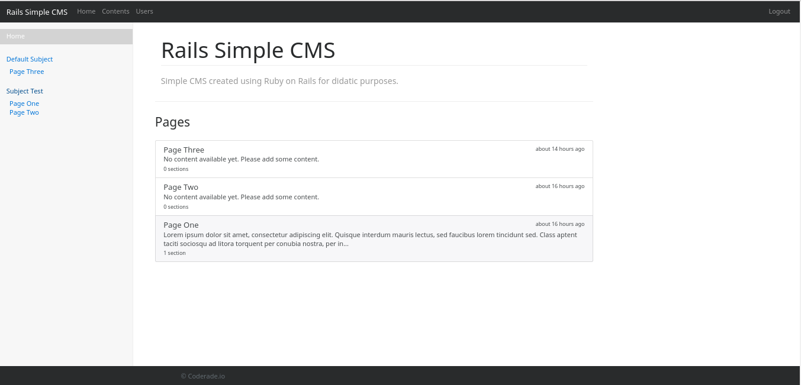
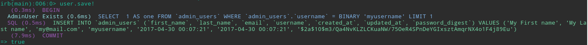

# rails-5-cms-template


**This project has been developed in 2015 for the purpose of studying the Rails framework on the version 5 and is not maintained anymore. Some libraries are being updated using the [Dependabot](https://dependabot.com/) and [Snyk.io](https://snyk.io/) services, but no further tests are being done.**


This is the application template of a CMS application created using Ruby on Rails 5.



## Used technologies

Although this project is a simple application, many technologies were used to develop it.
And the main were:

#### Client-side

* [CoffeeScript](http://coffeescript.org/) - a programming language that transcompiles to JavaScript. It adds syntactic 
sugar inspired by Ruby, Python and Haskell in an effort to enhance JavaScript's brevity and readability .
* [Bootstrap 4 Ruby Gem](https://v4-alpha.getbootstrap.com/) - Bootstrap 4 ruby gem for Ruby on Rails (Sprockets) 
and Compass.
* [Font Awesome](https://github.com/bokmann/font-awesome-rails) - the font-awesome font bundled as an asset 
for the rails asset pipeline.

#### Server-side
* [Rails 5](http://rubyonrails.org/) - a web-application framework that includes everything needed to create 
database-backed web applications according to the Model-View-Controller (MVC) pattern.                                                 
* [Bcrypt Ruby](https://github.com/codahale/bcrypt-ruby) - bcrypt-ruby is a Ruby binding for the OpenBSD bcrypt() 
password hashing algorithm, allowing you to easily store a secure hash of your users' passwords.
* [Puma](https://github.com/puma/puma) - a ruby web server built for concurrency.   

#### Database
* [MySQL](http://jade-lang.com) - the world's most popular open source database, and MySQL Cluster, a real-time, 
open source transactional database.


## Getting Started

To run the application, you need to have the [Ruby](https://www.ruby-lang.org/en/) installed. To install Ruby the best 
option is use the [RVM](https://github.com/rvm/rvm).
To get a example of a basic usage of the RVM, you can use their official doccumentation:
[RVM Basic usage](https://github.com/rvm/rvm#basic-rvm-usage).

After install Ruby, you can clone this project and install the dependencies. To do this you can run the following 
commands: 

1. Clone the repo

   ```
   git clone https://github.com/coderade/rails_cms.git
   cd rails_cms
   ```

2. Install dependencies

   ```
   bundle install
   ```

## Database setup

This application uses two main databases - one for development, one for testing, and if you want one for production. 
The database-specific configuration options are stored in `config/database.yml`, 
which we need to create from the example template.

```
cp config/example.database.yml config/database.yml
```

The project is configured to, by default, use MySQL, if you wish to set up your database differently,then you should 
change the values found in the `config/database.yml` file, and amend the instructions below as appropriate.

#### MySQL account setup

We need to create a MySQL role (i.e. user account) for your current user, and it needs to be a superuser so that 
we can create more databases. Create the user with the username defined on your `config/database.yml` file.

```
mysql
GRANT ALL PRIVILEGES on *.* TO 'rails_user'@'localhost' IDENTIFIED BY 'root';
exit
```

#### Create the databases

To create the two databases - for development and testing - run:

```
rake db:create
```

#### Database structure

To create all the tables, indexes and constraints, run:

```
rake db:migrate
```

## Running the application

If you are using a Unix machine, you can use the terminal to go to the root of the project and run the 
command `rails server` or `rails s` for shortly to starting the application using development mode.

Then you can navigate your browser to `http://localhost:3000` to see the app running.

#### Authenticating

This project use the [Bcrypt Ruby gem](https://github.com/codahale/bcrypt-ruby) to handles the authentication.
So to login, you need to create your first user using the `rails console`. 

To do this on the root of the project, run the command `rails console` or `rails c` for shortly.

And with the Rails console running, to create a new user run: 

   ```
    user = AdminUser.new(:first_name => 'My First name', :last_name => 'My Last name', :email => 'my@mail.com',:username => 'myusername', :password => 'mypassword')
   ```
And to save the created user:
   
   ```  
   user.save!
   ```

If the result is something like the image below:



The user has been created successfully, and you can go to the `http://localhost:3000/access/login` URL to login with it. 


## What's interesting?

There are few project images examples that you can view in the doc, to take a look on all available, go to the 
[IMAGES.md](doc/IMAGES.md) link.

* [Index page](doc/IMAGES.md#index-page)
* [Pages view page](doc/IMAGES.md#view-content-page)
* [Login page](doc/IMAGES.md#login-page)
* [Content Managing page](doc/IMAGES.md#contents-managing-page)
* [Content Edit page](doc/IMAGES.md#content-edit-page)
* [Users Managing page](doc/IMAGES.md#users-managing-page)


For more information on Rails please check out [Ruby on Rails](http://rubyonrails.org/).

---

If you have some question about this project, please [contact me](http://coderade.io/contact) and I will try to answer 
you ASAP.
